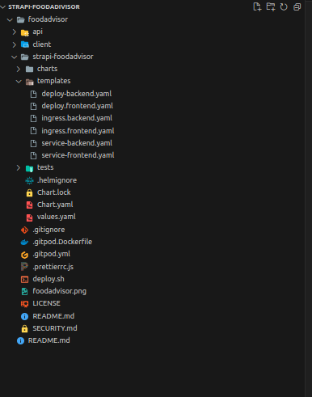
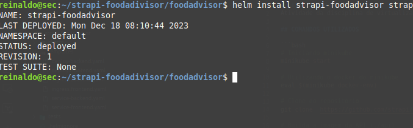
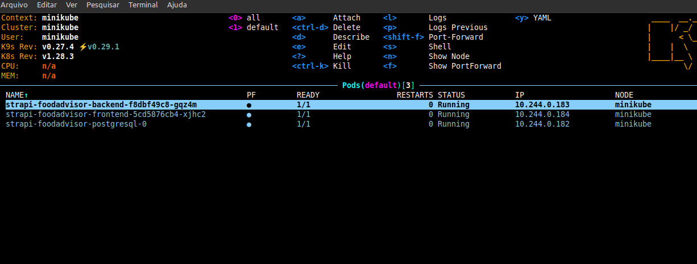

# strapi-foodadivisor
Atividade da disciplina de virtualização.

## COMANDOS UTILIZADOS

```bash
# Iniciando minikube
minikube start

# Utilizando o docker do minikube
eval $(minikube docker-env)

# Clone do repositório
git clone  https://github.com/strapi/foodadvisor.git

# Builda a imagem da API (./api)
docker build -t foodadvisor-api:1.0.0 ./api

# Builda a imagem do front (./client)
docker build -t foodadvisor-client:1.0.0 ./client

# Cria o deployment da API
helm install foodadvisor ./strapi-foodadvisor
```

## OUTROS COMANDOS

```bash
# Lista os deployments
kubectl get service,ingress

# Lista os pods
kubectl get pods

# Lista os deployments
kubectl get deployments
```

## IMAGEM DO DEPLOYMENT







